---

# Info

**insomniaHUD is a work-in-progress HUD designed for long play sessions. It is still in very early development, so many elements will be broken or completely unchanged.**

---

## Supported Resolutions

|Resolution|Supported|Comments|
|:-:|:-:|:--|
|16:9|🟢|Works flawlessly with a vertical resolution of **1080p** or above. There is mild visual jank on **720p** and below, but is still completely usable and functional.|
|16:10 / 8:5|🟢|Works flawlessly with a vertical resolution of **1080p** or above. There is mild visual jank on **720p** and below, but is still completely usable and functional.|
|21:9 (Ultrawide)|🟢|Works flawlessly with a vertical resolution of **1080p** or above. There is mild visual jank on **720p** and below, but is still completely usable and functional.|
|4:3|🟡|Works as long as the aspect ratio is *actually* **4:3**. Some **4:3** resolutions listed in the options menu are not actually **4:3**. Some elements may appear uglier, but is still fully usable and functional.|
|5:4|🔴|Not supported, and *probably* doesn't work.|

---

## Supported Gamemodes

|Gamemode|Supported|Comments|
|:-:|:-:|:--|
|Attack/Defend|🟢|Fully functional and customized. Includes Medieval and Snowplow.|
|Control Points|🟢|Fully functional and customized.|
|Territorial Control|🟢|Fully functional and customized.|
|KOTH|🟢|Fully functional and customized.|
|CTF|🟢|Fully functional and customized, Includes Special Delivery and Mannpower.|
|Payload|🟢|Fully functional and customized.|
|Payload Race|🟢|Fully functional and customized.|
|PASS Time|🟡|Fully functional, but is unmodified as of right now.|
|Mann Vs. Machine|🟡|Fully functional, but is unmodified as of right now.|

---

## Customization

### Through the In-Game menu
In the main menu, there is a button labeled `CUSTOMIZE HUD (WILL RESTART TF2)`. This will restart Team Fortress 2 and enable Customization mode. The options are self explanitory. As of right now you can only edit the colors, but more options such as Crosshairs and Hitmarkers will be added very soon.

---

## Screenshots

### Main Menu (Animated)
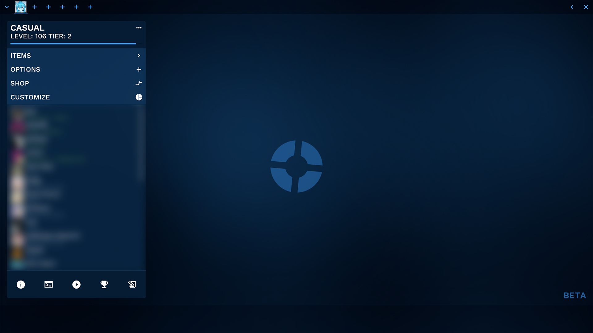
### Main Menu (In-Game) (Animated)
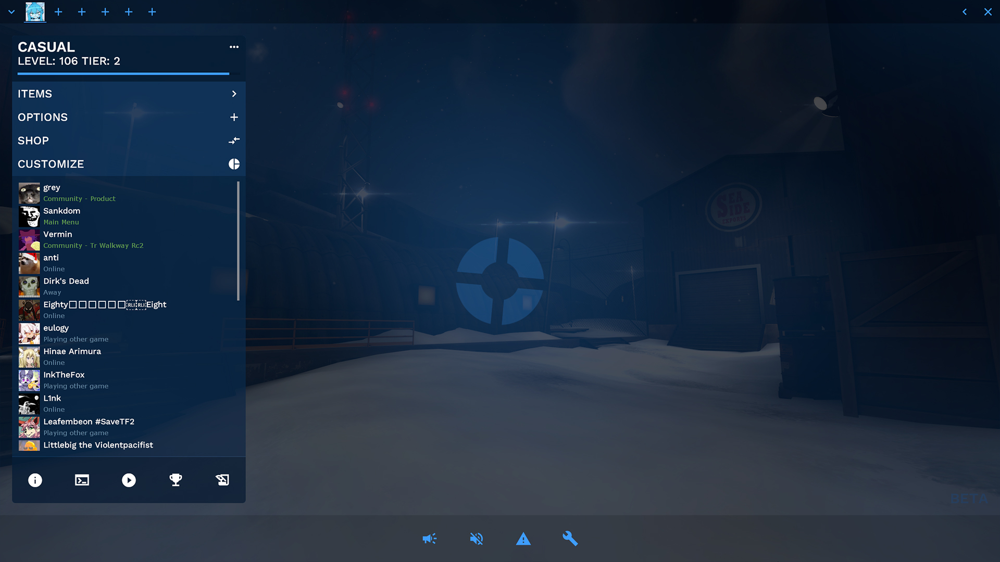
### Customization Menu (Animated)
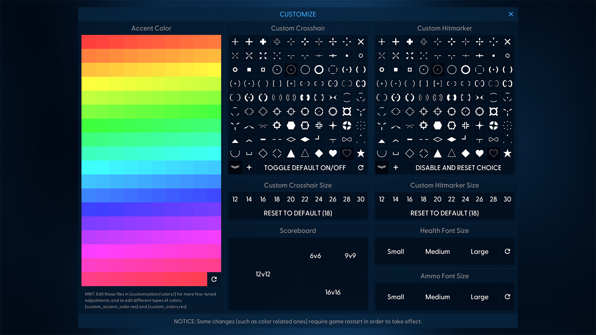
### Items Menu
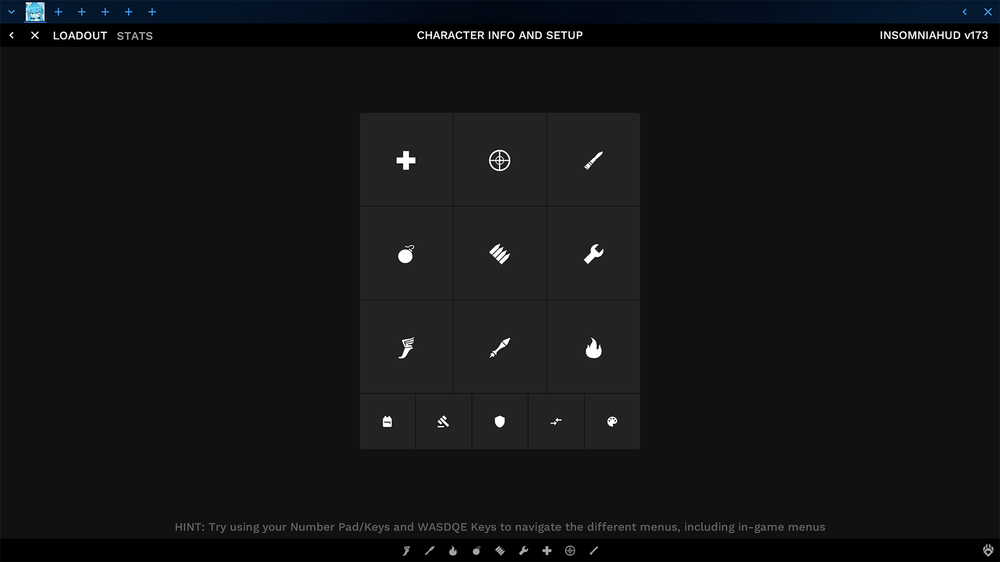
### Backpack
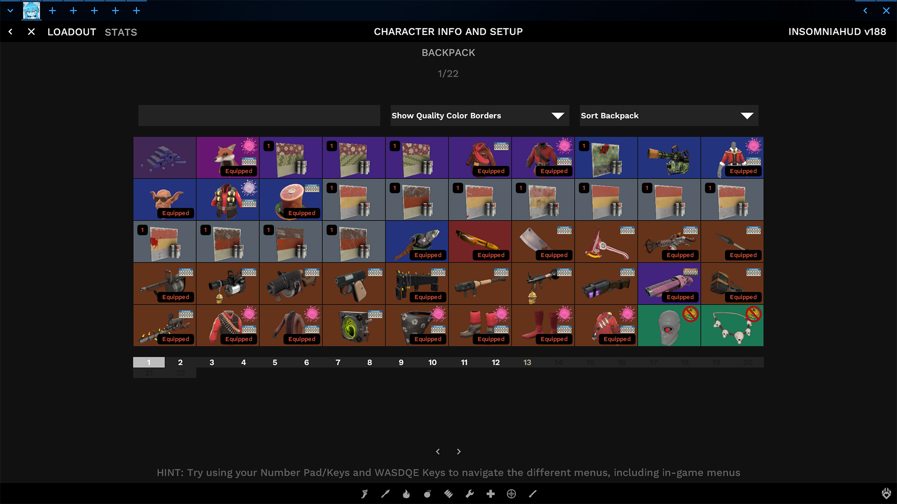
### Class Loadout
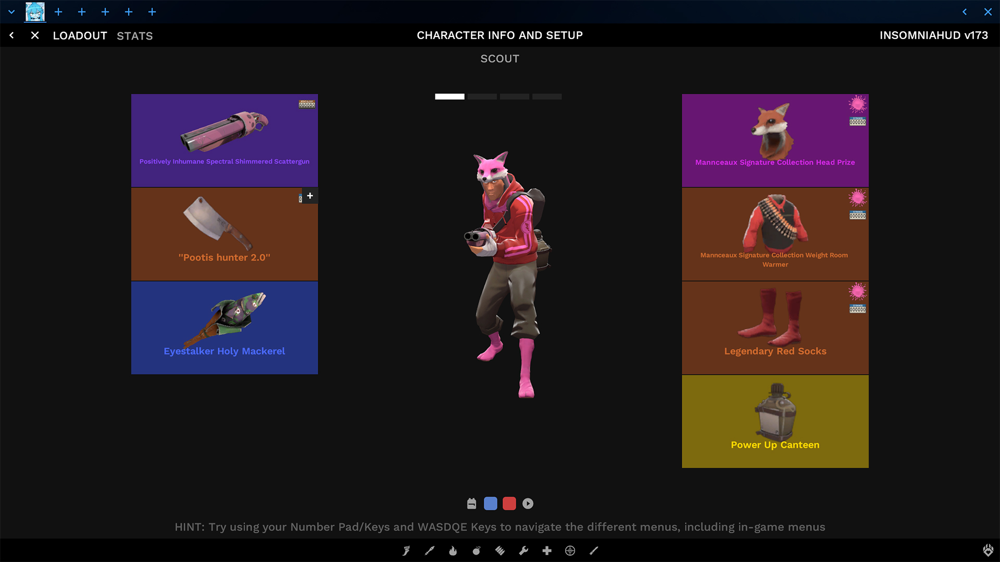
### Team Menu
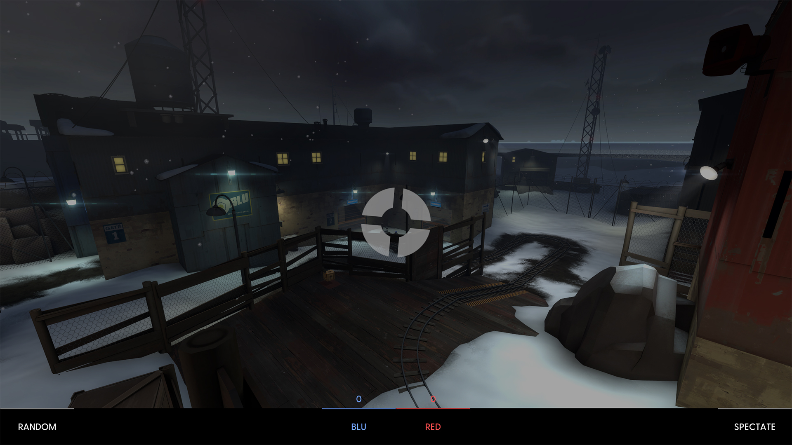
### Class Menu
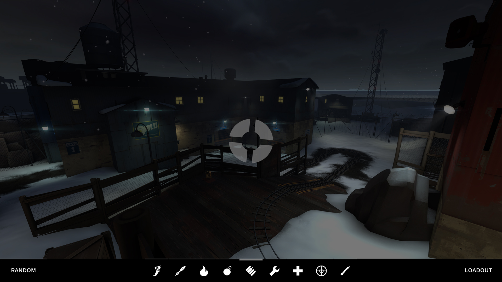
### Attack/Defend
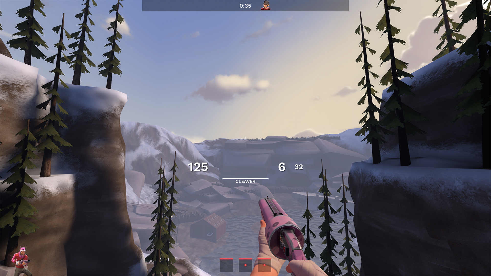
### Control Points
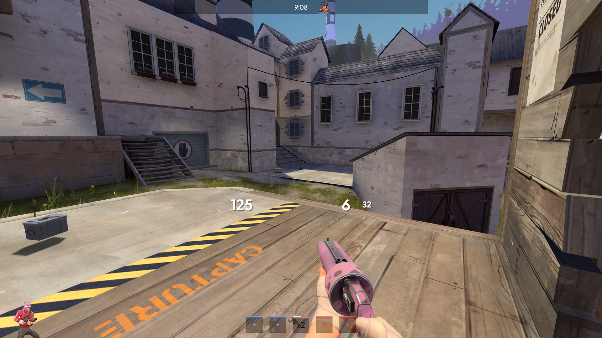
### CTF
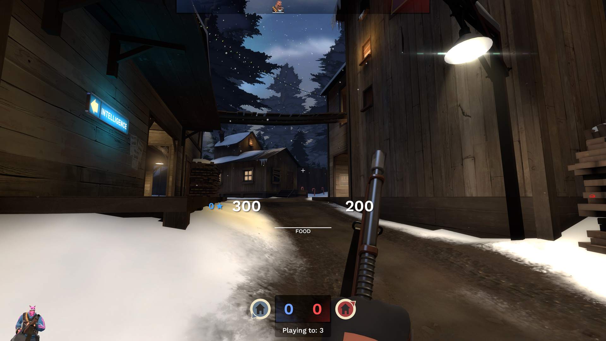
### Payload
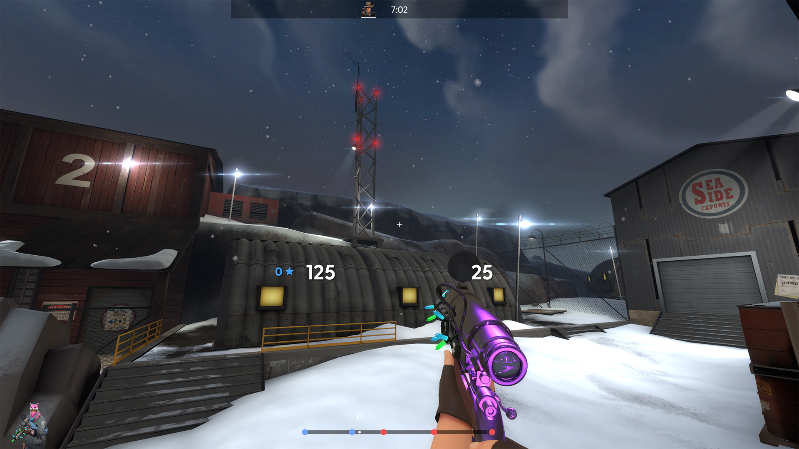
